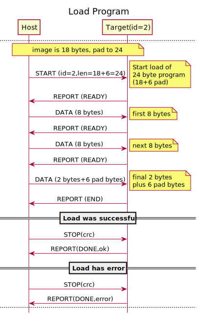
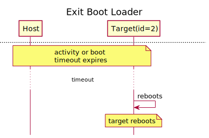

CAN Boot Loader Protocol
========================

This document describes the CAN message protocol that is used with the
ATMega CAN Boot Loader. It does not describe the hardware or implementation
of the boot loader.

For implementation details, see the [Specification](spec.md).

Frame Format
------------

The protocol uses extended format with 29-bit IDs (IDE bit is 1-recessive). All
frames are data frames (RTR bit is 0-dominant). All reserved bits are left as
0-dominant. Data length is always 8 bytes although the content of the data
is dependent on the boot loader command which is encoded into the identifier
field.

The identifier uses 21 bits with a fixed value that is meant to uniquely
specify this boot loader as the target device. Four bits are used to specify
the board ID (0-15), and four bits used for the boot loader command type.

The CAN bus rate is 250 kbits per second.

**Identifier Format**

| Bits  | Usage                         |
|-------|-------------------------------|
|`28:24`| 0x1B                          |
|`23:16`| 0x00                          |
|`15:8` | 0x71                          |
|`7:4`  | Board ID (0-15)               |
|`3:0`  | Boot loader command (0-15)    |

Messages
--------

All messages have 8 bytes in the CAN data field, but the number of bytes
actually used depends on the command field of the message ID. The useful bytes
are shown as "Data Len" in the table below. Any unused bytes are padded as
zeroes.

All messages originate from the host, except the REPORT message which is a
reply from the target. "Command" means the 4-bit command field of the CAN
message ID.

|Val| Command   | Data Len  | Description               |
|---|-----------|-----------|---------------------------|
|`0`| `PING`    | 0         | Probe for targets         |
|`1`| Reserved  | 0         | Reboot command deleted    |
|`2`| `START`   | 2         | Start program load        |
|`3`| `DATA`    | 8         | Sequential program data   |
|`4`| `STOP`    | 2         | End load with CRC         |
|`5`| `REPORT`  | 8         | Report from target        |

### PING

Used to probe for existence of a target running the boot loader. The target
will reply with a REPORT.

### REBOOT

(the reboot command has been removed)

### START

Initiate a data load. The payload is 2 bytes which is the data length of the
program. The length is little-endian. The program data follows with sequential
DATA messages. The target will REPORT indicating it is ready for program load.

### DATA

Program data that is meant to be loaded into the target memory. These messages
should be sent sequentially with 8 bytes of program data per message. If the
last sequence is less than 8 bytes, then the message should still contain 8
bytes padded with zeroes.

**Note:** the boot loader programs full flash pages. This is a hardware feature
and cannot be changed. The page size depends on the specific MCU, but for the
ATMega16M1 it is 128 bytes. If the image size is less than a whole number of
pages, a full final page is programmed. For example, if the program image size
is 257 bytes, then 3 pages of 128 bytes each will be programmed (a total of
384 bytes of flash).

After each DATA message, the target will send a REPORT message indicating it is
ready for more data.

### STOP

Complete the program load. This includes a 16-bit CRC that is used to verify
the load integrity. The CRC field is little-endian.

After the STOP message, the target will send a REPORT message indicating the
success of the program load.

#### CRC Specification

The CRC is a 16-bit CRC computed over the entire length of the binary image.
The boot loader firmware uses the function `_crc16_update()` to calculate the
CRC as the image is received. This is the function defined in the *avr-libc*
Library Reference
(see here https://www.nongnu.org/avr-libc/user-manual/group__util__crc.html).

The C implementation of this function is:

```c
uint16_t crc16_update(uint16_t crc, uint8_t a)
{
    crc ^= a;
    for (int i = 0; i < 8; ++i) {
        if (crc & 1) {
            crc = (crc >> 1) ^ 0xA001;
        } else {
            crc = (crc >> 1);
        }
    }

    return crc;
}
```

### REPORT

The REPORT message is issued by the boot loader running on the target. The
REPORT message has 8 bytes, defined as follows:

| Byte  | Usage                                 |
|-------|---------------------------------------|
| 0     | Boot loader major version             |
| 1     | Boot loader minor version             |
| 2     | Boot loader patch version             |
| 3     | Status (0-ok, 1-error condition TBD   |
| 4     | Report type                           |
| 5:6   | Report data, depends on type (see note)|
| 7     | 8-bit received message counter        |


**Notes:**

- The value in the report data fields (bytes 5:6) is undefined if the REPORT
  does not define a meaning for those fields.
- No status error conditions have been defined for the status byte and at this
  time it is always a `0`.

#### Report Types

|Val| Type  | Description                                                           |
|---|-------|-----------------------------------------------------------------------|
|`0`|`PONG` | Reply to PING, no data                                                |
|`1`|`READY`| Ready for DATA message with program data                              |
|`2`|`END`  | Last DATA was received                                                |
|`3`|`DONE` | Acknowledge load completion, byte 5 contains status (1-ok, 0-error)   |
|`4`| N/A   | Removed reboot acknowledement                                         |
|`5`|`ERR`  | Unknown message or other error                                        |

**Notes:**

- If the boot loader receives a boot loader message but does not understand the
  command field, it will reply with a REPORT with type ERR. Byte 5 of the data
  field will contain the "bad" received command ID.

Process
-------

The "host" is the CAN device that is controlling the bus. The "target" is the
CAN device that is running the boot loader and being controlled.

### Flow Control

The boot loader uses Command-Reply flow control. Only one command should be
sent from the host at a time, and the target will always reply with a REPORT.
The host should not send another message until the REPORT is received. The
target is a resource constrained device and cannot receive bursts of data.

### Timeouts

To avoid geting stuck in an error situation where the target is not responding,
the boot loader implements an internal timeout when there is no activity. There
are two timeout values, a boot timeout, and an activity timeout.

#### Boot Timeout

The "boot timeout" is used whenever the target reboots. By default this time is
2 seconds. The purpose of this timeout is to allow a host to gain control of
the boot loader when the terget resets. If the boot loader running on the
target receives a boot loader messsage within the boot timeout, then the boot
loader will switch to boot loading mode and not start the application.

If no boot loader command is received within the boot timeout, then the boot
loader will start the application, if it can. If the application does not pass
integrity checks, then it will instead enter boot loading mode and await
further commands (subject to activity timeout, see below).

#### Activity Timeout

When the boot loader has been activated by command during the boot timeout, or
by commanded entry from the application, then there is an "activity timeout" of
10 seconds. If the boot loader does not receive any command from the host
during the activity timeout, then it will attempt to start the application. If
the application does not pass integrity checks, then it will force a reboot.

The purpose of this timeout is to ensure that the boot loader cannot get hung
in a situation where the host cannot communicate or continue an operation. Note
that if the activity timeout occurs in the middle of a load, and the host is
not able to complete the load, the forced reboot will just cause the boot
loader to remain in control because the application was partially overwritten.

### Starting the boot loader

The boot loader always runs first when the target is reset for any reason. The
boot loader distinguishes between a reset due to watchdog timeout (WDT) and all
other reset causes. A reset due to WDT is considered to be either an
application error, or to be deliberately caused by the application. Therefore,
the proper way for the application to enter the boot loader is to allow the
WDT to expire.

If the boot loader is started due to WDT, then it will remain in boot loader
mode for the activity timeout.

A reset cause due to power-on reset (POR) or hardware reset is considered a
"normal" reset that should start the application.

If the boot loader is entered by a reset that is not WDT, then it will wait
for the shorter "boot timeout" for any boot loader commands. If a command is
received in that time, then it will remain in the boot loader for at least the
activity timeout.

If no boot loader command is received during the boot timeout or activity
timeout, then the boot loader will perform an integrity check of the
application. If the check passes, then the application is started. If the
check does not pass, then the boot loader continues to run, subject to the
activity timeout.


### Probing for devices

The host can probe for presence of any devices running the boot loader by using
the PING message. The host should issue the PING message with the board ID
(0-15) of any device it expects to find. A target running the boot loader will
send a REPORT message indicating a PONG reply.


### Loading a program

The process of loading a program will overwrite any existing application on the
target. This means that the loading process must be completed or the
application cannot be started.

The host sends a START message with the length of the program, in bytes. The
length is in 2 bytes of the payload and is little-endian. If the actual length
of the image is not a multipe of 8 bytes, the host must adjust the length to
be a multiple of 8 bytes and add padding bytes to the end as necessary.

After sending a start the host must wait for a REPORT of type READY, indicating
the target can receive a block of data.

When the host receives a REPORT indicating the target is ready for data, it
should send the first DATA message with the first 8 bytes of the program. It
should then wait for another REPORT(READY), and then continue with another DATA
message in this fashion. After each DATA message a report will be recieved,
and the host should not proceed until it receives a report for each DATA
message.

If the program size is not an exact multiple of 8 bytes, then the last DATA
message will contain the final bytes of the program image, plus the padding
bytes that were added by the host to make the length a multiple of 8 bytes.

The boot loader keeps track of the received byte count and knows when it should
receive the last DATA message. The REPORT after the last DATA message will be
an "END" type, indicating the end of the program load, instead of READY.

After all the program data has been sent and the REPORT(END) to the final DATA
message is received, then the host can send the STOP message. This message
payload contains CRC bytes which is the CRC of all the program bytes that
was just uploaded including the padding bytes. This message tells the boot
loader to complete the program loading process and to mark the loaded image as
complete. The boot loader will use the CRC to verify the integrity of the load.
It will respond with a REPORT message with type DONE, acknowledging the load is
complete and an indication of success or failure.

See the *STOP* command above for the CRC specification.



If the program load is not completed with a final report indicating success,
then the boot loader will not be able to start the application. The target will
remain in boot loader mode.

### Exiting the boot loader

The boot loader will always attempt to start the application after either the
boot timeout or activity timeout expires, and if that fails it will reset due
to WDT and the boot loader starts again.

A REBOOT command was considered but removed as not necessary and to simplify
the app starting logic.

See also the startup flow diagram in
[Starting the boot loader](#starting-the-boot-loader).


